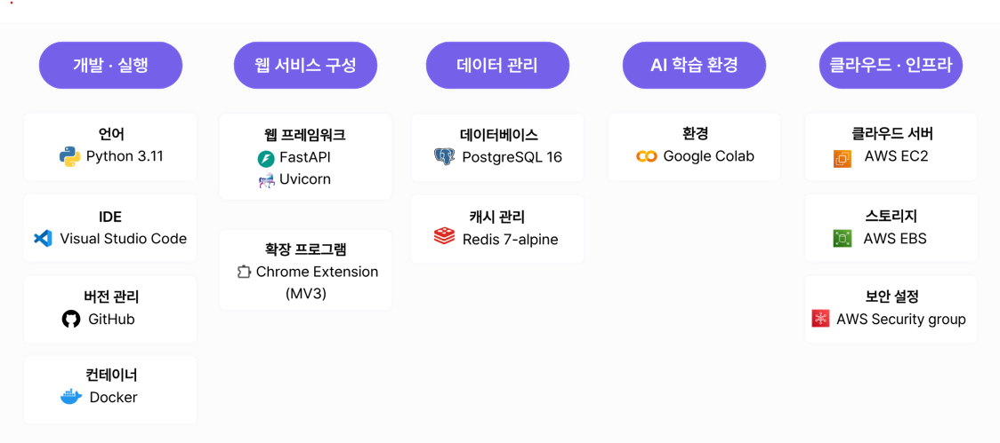
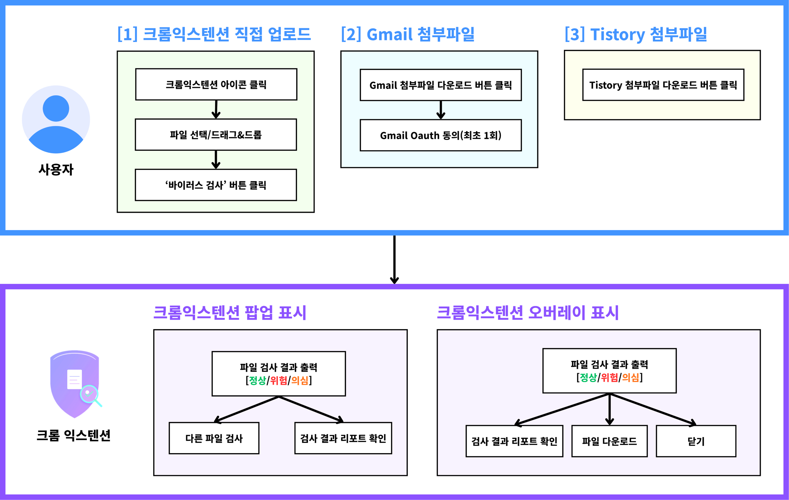

# KnowMal

**문서 실행 전 악성 행위 예측 서비스**

KnowMal은 AI 기반의 문서 보안 분석 서비스로, Microsoft Office 문서와 압축 파일의 악성 행위를 사전에 탐지하고 예측합니다. Gmail 및 Tistory 파일 검사 기능을 통해 실시간으로 파일의 안전성을 확인할 수 있습니다.

---

## 서비스 개요

KnowMal은 다음과 같은 핵심 기능을 제공합니다:

- **Office 문서 정적 분석**: DOC/DOCX, XLS/XLSX 파일 정적 분석
- **압축 파일 분석**: ZIP, RAR, 7Z 등 압축 파일 내부 파일 검사
- **Gmail 통합**: 이메일 첨부파일 실시간 보안 검사
- **Tistory 연동**: 블로그 첨부파일 자동 보안 검증
- **AI 기반 분류**: 앙상블 머신러닝 모델을 통한 네트워크 위협 분류
- **설명 가능한 AI**: SHAP 기반의 분석 결과 해석 제공
- **VirusTotal 연동**: 기존 보안 데이터베이스와의 교차 검증
- **상세 보고서**: Gemini API를 활용한 자연어 기반 분석 보고서

---

## 기술 스택



---

## 서비스 구성도


---

## 폴더 구조

```
KnowMal/
├── backend/
│   ├── app/
│   │   ├── api/
│   │   ├── core/
│   │   │   └── static_analyzer/
│   │   │       ├── parsers/
│   │   │       └── schemas/
│   │   ├── models/
│   │   ├── services/
│   │   ├── db/
│   │   ├── external/
│   │   └── templates/
│   ├── docker-compose.yml
│   ├── Dockerfile
│   └── requirements.txt
├── extension/
├── postgres/
└── docs/
```

---

## 사용자 흐름도



---

## 시연 영상

[](https://youtu.be/z-BPD3NpFFM)

**🎥 [KnowMal 시연 영상 보기](https://youtu.be/z-BPD3NpFFM)**

---

## 주요 기능

### 1. 파일 업로드 분석
- **지원 형식**: DOC/DOCX, XLS/XLSX, ZIP, RAR, 7Z
- **정적 분석**: OLE 구조 분석, 매크로 탐지, VBA 코드 분석
- **AI 분류**: 앙상블 머신러닝 모델을 통한 네트워크 위협 분류

### 2. Gmail 통합 보안 검사
- **실시간 스캔**: 이메일 첨부파일 자동 보안 검사
- **경고 시스템**: 위험한 파일에 대한 즉시 알림
- **OAuth 인증**: 안전한 Google 계정 연동
- **첨부파일 차단**: 악성 파일 다운로드 방지

### 3. Tistory 블로그 파일 검증
- **블로그 모니터링**: Tistory 게시물의 첨부파일 자동 검사
- **안전성 확인**: 파일 다운로드 전 보안 검증
- **사용자 알림**: 위험한 파일에 대한 경고 메시지

### 4. AI 기반 분석
- **앙상블 모델**: 다중 모델 조합
- **Knowledge Distillation**: 경량화된 고성능 모델
- **SHAP 분석**: 예측 결과에 대한 설명 가능한 AI
- **특성 중요도**: 파일의 위험 요소 시각화

### 5. 상세 보고서 생성
- **포괄적 분석**: 파일 구조, 메타데이터, 위험 요소 종합 분석
- **Gemini 해석**: 자연어로 된 분석 결과 설명
- **VirusTotal 연동**: 기존 보안 데이터베이스와의 교차 검증

### 6. 압축 파일 분석
- **다층 분석**: 압축 파일 내부의 개별 파일 검사
- **중첩 압축**: 압축 파일 내 압축 파일 재귀 분석
- **통합 보고서**: 모든 내부 파일의 종합적인 위험도 평가

### 7. 캐싱 및 성능 최적화
- **Redis 캐싱**: 분석 결과 캐시를 통한 빠른 응답
- **SHA256 기반**: 파일 해시를 이용한 중복 분석 방지
- **백그라운드 처리**: 대용량 파일의 비동기 분석
